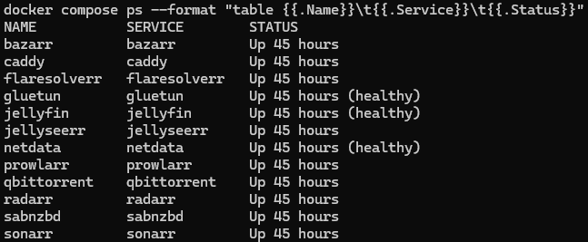
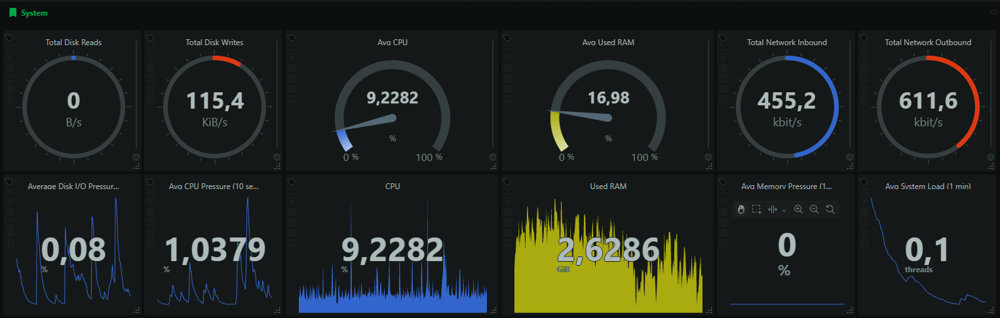
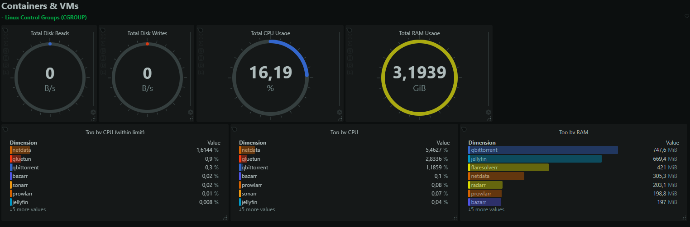
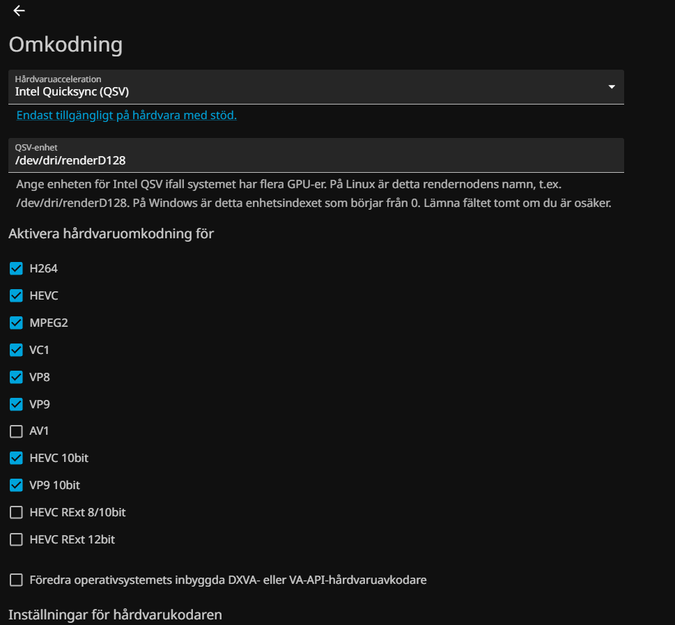

# Linux Home Server

A real personal homelab built on **Debian 13 + Docker Compose** to learn practical Linux administration, container networking, self-hosting, storage management, monitoring, HTTPS reverse proxying, VPN isolation, hardware-accelerated media playback, and troubleshooting.

> **Scope:** this is a student/personal infrastructure project, not production or enterprise infrastructure. The configuration published here is a sanitized and parameterized version of the configuration used on the live server.

## Project overview

The server runs headless on repurposed desktop hardware and hosts a 12-service Docker Compose stack. Public web access is intentionally limited to selected services behind Caddy, while Tailscale is retained for private administration. qBittorrent shares Gluetun's network namespace, and Jellyfin uses Intel Quick Sync through `/dev/dri`.

### Hardware

| Component | Current system |
|---|---|
| OS | Debian GNU/Linux 13 (Trixie) |
| CPU | Intel Core i5-8600K — 6 cores / 6 threads |
| RAM | 16 GB |
| System storage | 250 GB NVMe SSD |
| Media storage | 3 TB SATA HDD |
| Container runtime | Docker Engine 29.7.2 |
| Orchestration | Docker Compose v5.5.0 |

### Services

| Service | Role |
|---|---|
| Jellyfin | Media server with Intel Quick Sync |
| Jellyseerr | Request interface |
| Sonarr / Radarr | TV and movie library automation |
| Prowlarr | Indexer integration |
| Bazarr | External subtitle management |
| qBittorrent | Download client |
| Gluetun | VPN network namespace for qBittorrent |
| Caddy | HTTPS reverse proxy |
| Netdata | Host, Docker, disk and SMART monitoring |
| FlareSolverr | Optional support service for compatible workflows |
| SABnzbd | Installed/experimental; not part of the active workflow |

## Architecture

The server separates four main concerns:

- **Public access:** the router forwards only TCP 80, TCP 443 and UDP 443 to Caddy. Caddy reverse-proxies Jellyfin and Jellyseerr.
- **Private administration:** Tailscale is retained for remote administration and management access. Funnel was tested earlier and is now disabled.
- **VPN-routed download traffic:** qBittorrent shares Gluetun's network namespace through `network_mode: "service:gluetun"`.
- **Storage:** Debian, Docker configuration and download staging are on the NVMe, while the final media library is stored on a separate 3 TB HDD mounted at `/srv/media`.

The detailed service relationships, storage layout and network boundaries are documented in **[docs/architecture.md](docs/architecture.md)**.

## Selected implementation details

- **Intel Quick Sync:** Jellyfin receives `/dev/dri` and uses `/dev/dri/renderD128` for supported hardware transcoding.
- **VPN isolation:** qBittorrent uses `network_mode: "service:gluetun"`.
- **Public ingress:** the router forwards only TCP 80, TCP 443 and UDP 443 to Caddy.
- **Private administration:** Tailscale is active for remote administration; Funnel was tested and then disabled.
- **Persistent data:** service configuration is stored under `/srv/docker`.
- **Media mount:** the media HDD is mounted at `/srv/media` using ext4 with `noatime`.
- **Monitoring:** Netdata monitors host resources, Docker state, storage utilization and SMART/NVMe health.

## Problems I actually diagnosed

This project was built iteratively, and troubleshooting became a major part of the learning experience.

### Root filesystem unexpectedly full

I used `df`, `du`, and `lsof +L1` to find a large deleted media file that was still held open by qBittorrent. Restarting the container released the file descriptor and returned the disk space.

### Jellyfin transcode cache growth

The transcode cache grew to tens of gigabytes during playback testing. I isolated it from general Docker usage and cleaned stale transcodes safely after stopping the service.

### Hardlinks not working despite being enabled

Sonarr/Radarr and qBittorrent share a consistent `/data` layout inside containers, but `/srv/downloads` lives on the NVMe while `/srv/media` is a different HDD filesystem. Linux hardlinks cannot cross that boundary, so imports become physical copies.

### Subtitle-triggered transcoding

Image-based PGS subtitles caused unnecessary transcoding on some clients. I moved to external SRT subtitle handling through Bazarr and configured Jellyfin to prefer text subtitles.

### Network exposure cleanup

While reviewing active listeners with `ss -lntup`, I found an old Tailscale Funnel configuration and an `iperf3` server still enabled after testing. Funnel was reset and the iperf3 systemd service was disabled.

More details: **[docs/troubleshooting.md](docs/troubleshooting.md)**.

## Screenshots

### Docker Compose stack



### Host monitoring



### Container monitoring



### Intel Quick Sync in Jellyfin



Additional screenshots are referenced from the monitoring and architecture documentation.

## Repository layout

```text
.
├── compose.yml
├── .env.example
├── Caddyfile.example
├── config/
│   └── netdata/
├── docs/
│   ├── architecture.md
│   ├── media-automation.md
│   ├── monitoring.md
│   ├── netdata-alerts.md
│   ├── networking.md
│   ├── roadmap.md
│   ├── storage.md
│   └── troubleshooting.md
└── screenshots/
```

## Public configuration and security

The live runtime configuration is **not** stored in this repository. The published Compose file is parameterized with environment variables and example values.

Excluded from the repository include real `.env` files, VPN credentials/keys, API keys/tokens/cookies, live IP addresses and DNS names, application databases/runtime configuration, Caddy certificates, Netdata databases/raw metric exports, torrent/NZB files, tracker/indexer credentials, media files and download history.

Before publishing changes, I use **[SECURITY-PUBLISHING.md](SECURITY-PUBLISHING.md)**.

## Responsible-use note

This repository exists to demonstrate Linux, Docker, networking and systems-administration experience. It does not provide tracker URLs, magnet links, media files, credentials, or instructions for obtaining copyrighted material. Self-hosted applications should be used only with content and services the operator is authorized to use.

## Current limitations / roadmap

This is intentionally documented as a homelab rather than a polished production platform. Improvement areas include automated configuration backups, restore testing, improved storage layout for functional hardlinks, tighter management-interface exposure, UPS support and additional storage-health monitoring.

See **[docs/roadmap.md](docs/roadmap.md)**.

## Documentation

- [Architecture](docs/architecture.md)
- [Networking](docs/networking.md)
- [Storage](docs/storage.md)
- [Monitoring](docs/monitoring.md)
- [Netdata alert coverage](docs/netdata-alerts.md)
- [Troubleshooting](docs/troubleshooting.md)
- [Roadmap](docs/roadmap.md)
