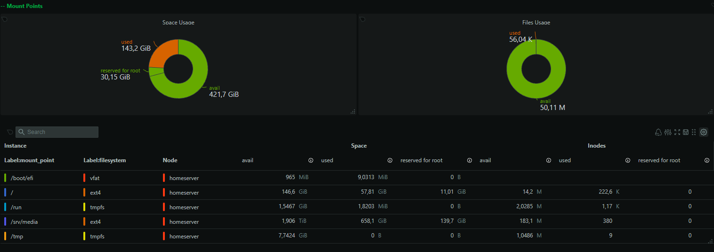

# Monitoring

Netdata is used to monitor the Debian host, storage devices, and Docker containers.

The live deployment mounts host system information and the Docker socket into the Netdata container so it can observe host and container health. The public repository includes only the small custom configuration files that were intentionally created; Netdata runtime databases, caches, raw metrics, and host-identifying metadata are excluded.

## What is monitored

The current setup is used to observe:

- CPU load and utilization
- memory and swap usage
- NVMe and HDD storage usage
- disk health through SMART data
- Docker container state
- container/resource activity
- filesystem pressure during large downloads or transcodes

## SMART monitoring

A custom `smartctl` collector configuration polls the server's storage devices every 60 seconds.

Published example:

```yaml
jobs:
  - name: storage
    extra_devices:
      - name: /dev/sda
        type: sat
      - name: /dev/sdb
        type: sat
      - name: /dev/nvme0
        type: nvme
    poll_devices_every: 60
```

The device names reflect the Linux device classes used on the homelab. Hardware serial numbers and SMART output are deliberately not committed.

## Docker container-down alert

A custom Netdata health template watches Docker container state:

```text
template: docker_container_down
on: docker.container_state
chart labels: container_name=*
every: 10s
lookup: average -10s of exited
warn: $this > 0
```

The alert is intentionally generic so newly added containers are covered automatically instead of maintaining a hard-coded list.

The configuration delays repeated notifications and increases the delay between repeated alerts to avoid excessive alert noise.

## Configuration evolution

An older, narrower Docker alert file existed with a hard-coded list of selected containers. It was disabled after replacing it with the generic `container_name=*` template.

The disabled legacy file is **not** included in the public repository because it no longer represents the active configuration. This keeps the repository focused on the current setup rather than preserving every abandoned experiment.

## Monitoring used during troubleshooting

Netdata complemented normal Linux command-line tools rather than replacing them.

For example, storage incidents were investigated with:

```bash
df -h
du -xhd1 /
sudo lsof +L1
docker system df
```

Netdata then provided a convenient way to watch resource usage and container state over time.

## Raw metrics are intentionally excluded

During documentation work, Netdata's local API was used to inspect available information:

```text
/api/v3/info
/api/v3/allmetrics
```

Those raw exports are **not** committed. They can include live host metadata, interface details, container names, paths, and operational measurements that add little portfolio value and unnecessarily expose the running system.

The repository therefore includes:

- sanitized configuration examples
- documentation
- selected sanitized screenshots

and excludes:

- raw `allmetrics` output
- `info` API dumps
- Netdata databases
- Netdata cache
- `.environment`
- `.container-hostname`
- `.install-type`

## Main Netdata configuration

The live `netdata.conf` contains no active non-comment custom settings in the inspected portion, meaning the deployment primarily relies on Netdata defaults plus the explicit collector/health configuration documented here.

For that reason a copied `netdata.conf` is not included just to make the repository look larger.


## Alert coverage

A live alert-configuration export was reviewed. The full generated/default catalog is not committed; a curated explanation of the relevant alerts is available in [Netdata Alert Coverage](netdata-alerts.md).

## Screenshots

### System overview


Shows CPU, RAM, load, disk activity, and network throughput from the live Debian host.

### Storage / mount points



Shows the root filesystem and `/srv/media` mount together with filesystem type, space usage, and inode usage.

### Container monitoring


Shows aggregate container CPU/RAM activity and individual services from the Docker Compose stack.
